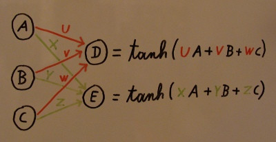
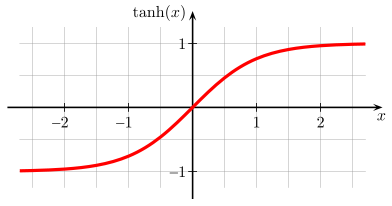
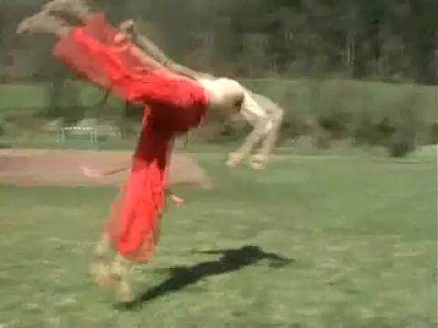
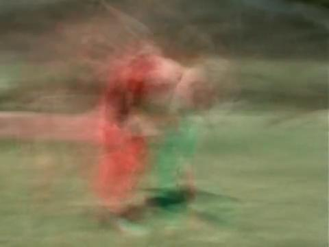

A too naive approach to video compression using artificial neural networks
==========================================================================

Introduction
------------
In computer vision neural networks often are used to classify images by the objects they depict. So one could theoretically also use them to detect if an image is a frame of a specific movie and if so at what position it occurs.
So why not try it the other way around?
In this article I will present my naive attempt to use a very simple neural network to learn the frames of a video in order to regenerate them later. Spoiler alert: It failed. But it was fun to try nonetheless. ;)

First, some background
----------------------
(Feel free to skip this section if you already have a basic idea of how ANNs work.)

An artificial neural network consists of neurons and the connections between them. One of the most simple neural networks is a feed forward perceptron. It has no circles in its directed graph. Here is a very small one:

It is composed of three neurons in the input layer and two neurons in the output layer. But there could a an arbitrary number of additional layers, called hidden layers, between them.

If you put values (usually 0 <= value <= 1) onto the input neurons, they propagate through the net to the right according to the weights of the connections. Every neuron has an [activation function](https://en.wikipedia.org/wiki/Sigmoid_function), which basically maps its summed input values back onto the interval [0,1]:

(image source: [Wikipedia](https://de.wikipedia.org/wiki/Tangens_Hyperbolicus_und_Kotangens_Hyperbolicus#/media/File:Hyperbolic_Tangent.svg))

The only modifiable thing of the net are the weights of the connections, so all information is stored there. To get a net to learn something you train it with data consisting of input vectors (values for the neurons in the input layer) and corresponding output values. During training the initially randomly preinitialized weights are optimized to make the output layer yield something close to the desired values of the training set.

Test Video
----------
Our test video consists of 84 single frames with a resolution of 480 * 360 pixels at 25 frames per second. And it looks like this:

[youtube link](https://www.youtube.com/watch?v=GqusTv0wp4c)

If you save it raw with 3 bytes per pixel (B, G and R) it is about 43 MB in size.

Neural Network without compression
----------------------------------
If we now construct a neural network with 84 input neurons, no hidden layer and 518400 (480 * 360 * 3) output neorons, it can easily be trained to learn the video perfectly. [Overfitting](https://en.wikipedia.org/wiki/Overfitting) is not a problem here, but even wanted. Every entry in the training data represents one frame. In the input layer only the neuron representing the current frame number is set to 1 while all others are 0. E.g. frame number 3/8 would be coded in the input layer with `[0,0,1,0,0,0,0,0]`. The output layer gets every pixel value (converted from [0,255] to [0.0,1.0]) mapped onto it.

After a very short training phase, the weights converge to the raw pixel values. But of course nothing is gained here, since there is no compression. We solely developed a fancy way to store raw pixel values in the form of 43545600 (84 * 480 * 360 * 3) connection weights.

Neural Network with compression
-------------------------------
The idea now is that we do not need to store all pixel values as weights. Since almost every video has recurring patters and constant or single-colored sectors it could be possible to store the information needed to reproduce frames sufficiently similar the the original ones with less than 43545600 weights. So we introduce two hidden layers.

`layersizes = [84, 10, 10, 518400]`

Now our net only weights 5184940 (84 * 10 + 10 * 10 + 10 * 518400) connections, i.e. roughly 12% of the prior version. So if we store our weights as 4-byte floats, we have 20 MB (20739760 bytes) in storage size. This is less than half the size of an uncompressed video format using 3 bytes per pixel, but still about 50 times the size of an H264 (1010 kBit/s) compressed version of the video with 0.36 MB (380007 bytes).

After about one hour of training on all my four CPU cores with [resilient backpropagation](https://en.wikipedia.org/wiki/Rprop) the result looks as follows:

[youtube link](https://www.youtube.com/watch?v=Qku14b_v-B8)

I experimented with different layer configurations and training parameters but did not obtain significantly better results.

Conclusion
----------
We can save a version of the video smaller than the raw format, and we see some blurry dream/ghost/drug-like effects, but have nothing suitable for real world video compression. Compression time, file size and video quality are terrible.

If you would like to play around with the source code, e.g. use different settings, try out another input video etc., you can find it here: [https://gist.github.com/Dobiasd/9234a8fe7ba958f79227](https://gist.github.com/Dobiasd/9234a8fe7ba958f79227)

Different possibilies to decode the frame number for the input neurons are already given by the instances of `NumToNNValuesFunc`.

Further links
-------------
In case you are wondering, if there are any successful attempts to use neural networks to generate images: Yes, there are plenty. Here are some very cool ones:

* [Inceptionism: Going Deeper into Neural Networks](http://googleresearch.blogspot.com/2015/06/inceptionism-going-deeper-into-neural.html)
* [New algorithm gives photos Picasso-style makeovers](http://mashable.com/2015/08/29/computer-photos/)

[discussion on reddit](https://www.reddit.com/r/programming/comments/3mvnz6/a_too_naive_approach_to_video_compression_using/)