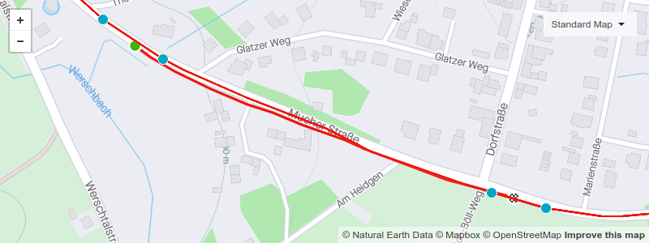

# Accurate timing of Strava segments

## tl;dr

[Strava](https://en.wikipedia.org/wiki/Strava "Strava is an app for tracking physical exercise, for example, bike rides. 🚴") calculates [segment](https://support.strava.com/hc/en-us/articles/216918167-Strava-Segments "Segments are portions of roads or trails where athletes can compare times and thus compete. 👑") times in an unnecessarily inaccurate way, resulting in unfair leaderboards. But there's an elegant way to improve the situation. 🌈

## Problem

[Strava explains](https://support.strava.com/hc/en-us/articles/216918187-Segment-Matching-Issues):

> When we match you to a segment, we choose the GPS points from your file that fall closest to the segment's start and end. Because of the nature of GPS and the differences in device recording intervals, it's unlikely that there will be a GPS point exactly on top of the segment's start/end. This means that you can be timed over portions of your activity that are slightly longer or shorter than the actual segment length. Everyone is susceptible to this, but you may get a short match that works in your favor or a long match that adds a few extra seconds.

[and](https://support.strava.com/hc/en-us/articles/216918227-Optimizing-Segment-Creation-how-to-create-good-segments#short):
> [...] the sampling rate of your GPS device; some devices only record a GPS point every 5 to 10 seconds

[Garmin confirms that devices can have varying recording invervals](https://support.garmin.com/en-US/?faq=s4w6kZmbmK0P6l20SgpW28):
> Smart Recording captures key data points as changes occur in direction, speed, heart rate or elevation. This method is recommended [...]


## Visual depiction

Following from the above, when two cyclists ride (also valid for, e.g., runners, btw.) along a segment with the same speed, depending on random chance, one might get a much better time than the other:

```
            start                                     finish
              |                                         |
              v                                         v
             🟢-----------------[segment]---------------🏁


--🔴-----🔴-----🔵-----🔵---[lucky effort]---🔵-----🔵-----🔴-----🔴--
                 ^                                   ^
                 |                                   |
               start                                end


--🔴-----🔵-----🔵-----🔵--[unlucky effort]--🔵-----🔵-----🔵-----🔴--
         ^                                                  ^
         |                                                  |
       start                                               end
```

## Solution

Instead of using the recorded GPS points closest to the segment start/end, one can calculate the closes point on the polygonal chain of the activity points, deduce the timestamp by interpolating the timestamps of the neighbor points, and use that:

```
            start                                     finish
              |                                         |
              v                                         v
             🟢-----------------[segment]---------------🏁


--🔴-----🔴--🔵--🔵-----🔵--[actual effort]--🔵-----🔵--🔵--🔴-----🔴--
              ^                                          ^
              |                                          |
       calculated start                            calculated end
```

This nicely fixes the problem resulting from low sampling rates, but it also further improves the precision of recordings with a high(-ish) sampling frequency (like 1 Hz).

## Implementation

[`accurate_timing_of_strava_segments.py`](accurate_timing_of_strava_segments/accurate_timing_of_strava_segments.py) is a Python script containing an exemplaric implementation of the described solution. ⏱️

## Real-life example

Taking [this segment](https://www.strava.com/segments/4391619) as an example, the leaderboard contains the following two efforts:
- `A`: Jun 25 2017: 33 s
- `B`: Sep 1, 2021: 34 s

When looking closer at the two activities, something seems fishy. `B` has fewer recorded GPS points than `A`. Also, the average speed of `A` seems higher when manually selecting the segment part of the activity on the analysis page.



(The blue points are `A`s GPS recordings closest to the segment start (green) and end (checkered).)

Running the script linked to above, we get the following results:
- `A`: **37.4 s** (instead of Strava's 33 s, i.e., +4.4 s difference)
- `B`: **34.1 s** (instead of Strava's 34 s, i.e., +0.1 s difference)

This shows, `B` actually performed significantly better in that segment than `A`. 🚀

## Plea

Dear Strava developers,

your app is a great source of joy for KOM hunters, but the above introduces an unnecessary and avoidable random factor into the segment leaderboards. Please consider implementing the described solution to remedy the situation.

And while you're at it, in 2022, you increased the minimum length for new segments to 500 m, presumably to reduce unfairness due to inaccurate measurements. The solution described here would fix this in a cleaner way, and you could reduce the minimum segment length again. (Especially for steep hills, 200 m often is more than enough.) Please remember, not all of us users are time trialists, some are sprinters. 😉
