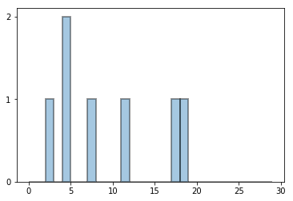
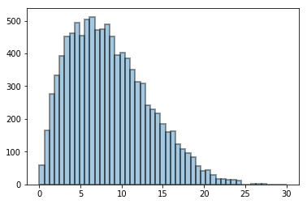
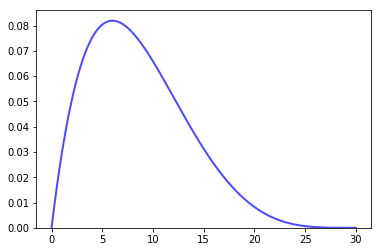
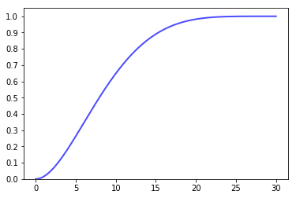
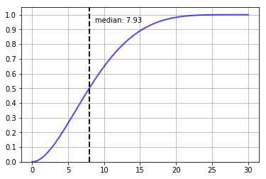
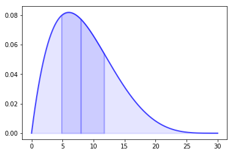

# Basic measures of descriptive statistics

Let's assume you want to analyze the distribution of one variable (univariate analysis), like the height of people, the sum of the value of purchases per user in your online shop, or the number of cats per house in your neighborhood. In any case, you always end up with one (sometimes quite large) a list of numbers.

To go with the online-shop example, assume your users made 7 purchases and paid the following amounts of money (the actual unit, i.e., dollars, can be omitted here):
`[4, 17, 2, 7, 18, 4, 11]`

The histogram looks as follows:



What follows are some basic statistical measures and how they are calculated.

## Location parameters

The most common measures of central tendency.

### Mean

The (arithmetic) mean is just the sum of all values divided by the number of values.

`mean = (4 + 17 + 2 + 7 + 18 + 4 + 11) / 7 = 9`

So it represents what one might call the "average amount spent in the shop".

### Median

The median is the value of the middle position after sorting the numbers.

`median = middle_value([2, 4, 4, 7, 11, 17, 18]) = 7`

While from the mean amount and the number of users we can, of course, get back to the overall amount easily: `overall_amount = mean * number_of_values`, from the median this is not possible. However, the median better represents the *typical* value. It is less vulnerable to outliers, i.e., the medians of `[2, 4, 4, 7, 11, 17, 18]` and `[2, 4, 4, 7, 11, 17, 918]` are the same (`7`), while the mean differs a lot. The median is also called the 50th percentile because 50% of the values are below it (and the other 50% are above). One can think of it as the value that most other values are clustered around.

### Mode

The mode is the value which appears most often. In our example:
`mode([2, 4, 4, 7, 11, 17, 18]) = 4`

## Scale parameters

### Variance

The variance is the mean of the squared distances of the values to the distribution's mean. In our example the mean is `9` so we end up with:

```
variance = mean([(2-9)², (4-9)², (4-9)², (7-9)², (11-9)², (17-9)², (18-9)²])
         = mean([49, 25, 25, 4, 4, 64, 81])
         = 36
```

One of the reasons to have the distances squared instead of plain, is to weight outliers more. (Others include advanced properties like being  continuously differentiable etc.)

The intuition for it is: A small variance means, the values, in general, are quite close to each other, while a big variance indicates a more spread-out distribution.

While, e.g., `[1, 4, 7]` and `[3, 4, 5]` have the same mean and median (both `3`), their variance differs significantly.

## Standard deviation

The standard deviation is simply the square root of the variance.
`standard_deviation = sqrt(variance) = sqrt(36) = 6`

Qualitatively, the standard deviation tells the same fact as the variance does. However, often the standard deviation is preferred because it's unit is the same as the one of the original distribution. So in our online-shop example, the standard deviation is 6 dollars.

## Probability density function

Your online shop grows, and you get more samples (purchases). The histogram now might look as follows:



Now we can fit a curve to it and normalize it in such a way, that the area under the curve (the integral) equals `1`. The result is called the probability density function (PDF). It represents the probability (y-axis) of purchase with a certain dollar value to occur. In that particular case, it has a positive skew, i.e., a longer tail at the right side.



## Cumulative distribution function

The integral of the PDF is the CDF (cumulative distribution function). It shows the probability that a random sample will have a value less than or equal to x.



What's nice about it, that we can simply read the median, i.e., the value with 1/2 of the samples on each side of it, from it.



Due to this property, the median is also called the "50th percentile". Other percentiles, e.g., the  90th one, are also often used. They can quickly be read from the CDF in the same way.

## Scale parameters (revisited)

### Interquartile range

The Quartiles are the three cuts, dividing a distribution into four groups of the same size:
- 25th percentile
- 50th percentile (median)
- 75th percentile

We can use them to overcome a problem of the variance (or standard distribution), i.e., weighting outliers too much in certain situations. Distributions with long thin tails (high "kurtosis") in either direction can bloat those measures quite a lot, which may be unwanted.

If we instead use the range from the 25th percentile to the 75th percentile as a measure of how spread out the distribution is, we are more resilient towards outliers.



This range is called the IQR (interquartile range).

`IQR = 75th_percentile - 25th_percentile ≈ 11.6844 - 4.8349 = 6.8495`

One way to eliminate outliers completely before calculating the other measures would be to only consider the values in the IQR. This process is called a 50% winsorization. A more typical value for winsorizing however would be 90%, i.e., dropping only the bottom and top 5% of the initial values.

---

In case you are interested, here is a short follow-up article: [Mechanical analogies for basic measures of descriptive statistics](mechanical_analogies_for_basic_measures_of_descriptive_statistics.md)