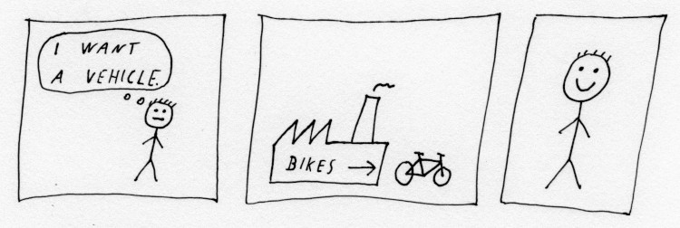
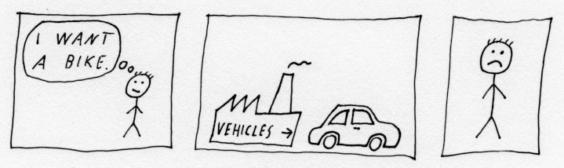
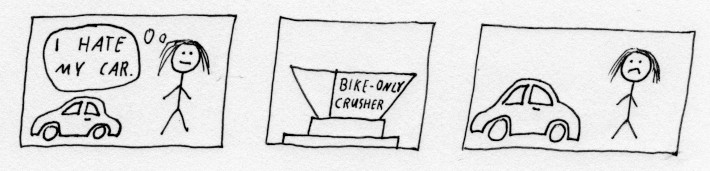

# Covariance and contravariance explained without code

Covariance and contravariance are concepts one can bump into (and initially be confused by) when working with object-oriented programming. This article explains the basic idea without requiring any programming knowledge.

Imagine you are a merchant of large industrial things, and you sell the following two types of products:
- `factory`: A thing that produces (spits out) stuff.
- `crusher`: A thing that consumes stuff, i.e., you can throw stuff, you want to get rid of, in it.

Your customers are mainly interested in vehicles, some especially in bikes. And it's common wisdom, that:

- Every `bike` is a `vehicle`. (But not every `vehicle` is a `bike`.)

```
 -----------
 | vehicle |
 -----------
      ^
      |
      | is a
      |
  --------
  | bike |
  --------
```

## Covariance

Your customer John wants to purchase a `vehicle factory`. He does not care what kind of vehicles it produces.
You supply him with a `bike factory`, and he is happy because a `bike factory` is a `vehicle factory`. It's just a special kind, which is ok.



It would not have worked the other way around! If John would have wanted a `bike factory` and you would have delivered a `vehicle factory` instead, he would be angry.



This is covariance in action:
- Every `bike` is a `vehicle`. (But not every `vehicle` is a `bike`.)
- Every `bike factory` is a `vehicle factory`. (But not every `vehicle factory` is a `bike factory`.)

```
 -----------     -------------------
 | vehicle |     | vehicle factory |
 -----------     -------------------
      ^                   ^
      |                   |
      | is a              | is a
      |                   |
  --------        ----------------
  | bike |        | bike factory |
  --------        ----------------
```

(Both "is a" arrows point in the same direction.)

## Contravariance

Now, your next customer, Jane, wants to buy a `bike crusher` from you. You don't have one on stock, so you provide a generic `vehicle crusher` instead, which is totally ok:


It would not have worked the other way around! If Jane would have wanted a `vehicle crusher` and you would have delivered a `bike crusher` instead, she would be angry.



This is contravariance in action:
- Every `bike` is a `vehicle`. (But not every `vehicle` is a `bike`.)
- Every `vehicle crusher` is a `bike crusher`. (But not every `bike crusher` is a `vehicle crusher`.)

```
 -----------     -------------------
 | vehicle |     | vehicle crusher |
 -----------     -------------------
      ^                   |
      |                   | is a
      | is a              |
      |                   v
  --------        ----------------
  | bike |        | bike crusher |
  --------        ----------------
```

(The two "is a" arrows point in opposite directions.)

## The difference between a factory and a crusher

The crucial point is already in the definitions.
- A factory produces.
- A crusher consumes.

Producing things (in programming: functions returning the object in question) exhibit covariance with the class of the object (`vehicle`/`bike`).
Consuming things (in programming: functions taking the object in question as an argument) exhibit contravariance with the class of the object (`vehicle`/`bike`).

## Code (if you really want to see it)

The below example is written in Kotlin, but the same logic applies to many other languages too.

```kotlin
interface Vehicle

interface Bike : Vehicle

// Covariance

interface VehicleFactory {
    fun produce(): Vehicle
}

interface BikeFactory : VehicleFactory {
    override fun produce(): Bike
}

// Contravariance

interface BikeCrusher {
    fun consume(bike: Bike)
}

interface VehicleCrusher : BikeCrusher {
    fun consume(vehicle: Vehicle)
}

fun john(factory: VehicleFactory) {
    val someVehicle = factory.produce()
}

fun jane(crusher: BikeCrusher) {
    val someBike: Bike = ...
    crusher.consume(someBike)
}


val someVehicleFactory: VehicleFactory = ...
val someBikeFactory: BikeFactory = ...
val someVehicleCrusher: VehicleCrusher = ...
val someBikeCrusher: BikeCrusher = ...

john(someVehicleFactory)
john(someBikeFactory)
jane(someVehicleCrusher)
jane(someBikeCrusher)
```
