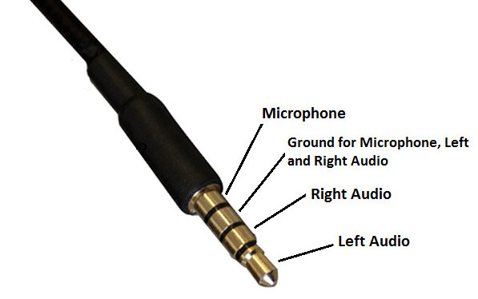

# How I got rid of the crosstalk in my headset

Many modern headsets have a TRRS audio jack, combining the headphone and the microphone into one plug.

While this is convenient for usage with smartphones, etc., it would be much better if headsets would provide two separate plugs, one for the headphones part and one for the microphone,

and maybe add an adapter,

because in the single-plug version, the headphone and the microphone (electrically) share the "ground", which makes the stuff you listen to (headphone) leak into the stuff the others hear coming from you (microphone).
- When gaming online while in a Discord channel, and you do something in the game, only you are supposed to hear, the others will hear it too.
- When on a zoom call, and you prefer listening to some music on YouTube instead of your colleagues, they hear it too. :-P
- ...

Wait, you think, does this guy really state that there is a fundamental design flaw in the general concept of many headphone plugs?

Yes, I do! :grin:

And it's not a minor effect, which you only recognize when really paying attention. Instead, it's very obvious. I've tested this with 3 different headsets on two different PCs (front and back audio ports, with the needed [adapter](how_i_got_rid_of_the_crosstalk_in_my_headset/adapter_split.jpg) to match the [ports](how_i_got_rid_of_the_crosstalk_in_my_headset/soundcars.jpg)), and the effect was strong in all cases. I invite you to experiment yourself if you have such a headset:
- Record your voice (use Audacity, a Zoom call, whatever).
- Play some music on your headphones (e.g., search for "fast piano music" on YouTube to have the maximum effect).
- Listen to the recording and be surprised.

If you are lucky and have a headset with two separate plugs, you can re-create this effect by coupling the two ground signals with adapters like this.

**Conclusion: Don't ever buy a headset with a combined (TRRS) audio jack!** (Instead, buy something with two separate audio jacks, or USB, or wireless.)

So here the general story already ends. But in case you're interested in how I got rid of this annoying effect in my day-to-day headset (Jabra Evolve 40 UC), please read on. :slightly_smiling_face:

First, I opened it and was happily surprised, that the ground of the headphone and the microphone is not yet shared directly. Instead, they go through the cable as separate strands.

Then, I cut off the jack

melted off the insulation

and then, using a multimeter

I checked which colors are connected to what part of the jack.

From that one can see the function of each colored strand. (The pink one is some proprietary Jabra thing, probably for their [USB-link thingy](how_i_got_rid_of_the_crosstalk_in_my_headset/jabra_usb.jpg). We can ignore it here.)

So after un-insulating the strands in the cable going to the headset, I connected them to separate plugs with terminal blocks. (You can, of course, do this much more nicely and compact by soldering, maybe even directly in the headset, replacing the cable completely.)

Then, putting this all into some custom made case with strain relief,

And we have a stupidly huge box. (Luckily I only use the headset at my desk, so it does not matter.)

  

It works perfectly. :tada:

I have no idea how long it will last, but at least I'm crosstalk-free now. :sunglasses:

(Next time, I'll definitely not buy a headset with such a TRRS plug. -_-)
