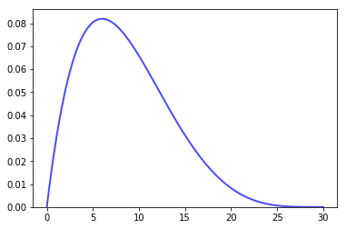
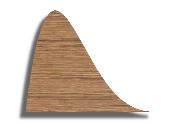
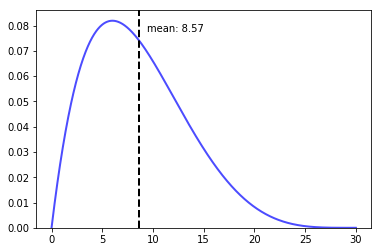
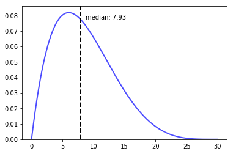
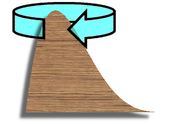

# Mechanical analogies for basic measures of descriptive statistics

(This article assumes you to know what the "mean", median and variance of a distribution are. In case you could need a quick refresher on this topic, please have a look at [*Basic measures of descriptive statistics*](basic_measures_of_descriptive_statistics.md) first.)

Let's assume we would cut a thick, but flat, wooden model from a distribution like this. The usual basic measures of descriptive statistics would represent real physical properties of it.

(I know, this looks amazingly realistic. Sadly I'm currently not available to accept design projects. ^_-)

## Mean

The mean is the center of gravity in regards to the x-axis. So we could hang it on a thread as a crib mobile at this position, and it would not tilt.
Also, we could balance it on a rod aligned with the mean line.

## Median

We cut our wooden distribution model in two parts along the median, both halves have the exact same weight.

## Variance

We spin our model around its vertical axis. It spins around its mean if we don't attach it so something. And the moment of inertia for this rotation is equivalent to the variance of our distribution. So the variance is proportional to the torque needed for some angular acceleration.