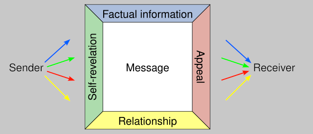

# On feeling deceived when receiving (non-labeled) LLM-generated messages

Seeing LLM-generated articles or social media posts is nothing new. We're used to double-checking important things, so we don't blindly believe factually wrong hallucinations of some GPT.

However, the more personal the communication becomes, the stronger I feel against receiving generated messages without them being labeled as such. As an extreme example, imagine you write to your significant other (about some topic that is important to you), and they copy-paste your text to the "AI" and prompt it to "please respond on my behalf". When you find out you might feel angry, sad, and deceived.

This extreme example shows that it's not just about the annoyance of having invested the effort in reading and understanding something that the sender did not invest the effort in thinking through and writing. To understand where the feeling of deception originates from, we need to appreciate that there is [more](https://en.wikipedia.org/wiki/Four-sides_model) to communication than just the factual information in a message. And this is not only true for love relationships. Even when you exchange texts with a friend or work colleague, and even if it's about a sober topic (like in a technical discussion in the comment section of a company-internal document), usually,
- the sender reveals something (emotions, etc.) about themselves.
- one can find hints about the relationship between sender and recipient "between the lines".
- the nuances in the phrasing imply some appeal the writer intends to invoke in the reader.

When the alleged sender did not actually write the text, these additional sides of the message are no longer real. For an unaware recipient, who (maybe subconsciously) also processes these three other sides, this can lead to incorrect assumptions and expectations in the future, and to a false feeling of connectedness.

Sure, there is a continuous spectrum from
- "outsourcing a conversation completely to AI"
- over "generating only a part of a message"
- to "just using a fact or idea that you got from an AI at some point"

and it's subjective where to set the "I should label this as LLM-powered" threshold.

But please keep the four-sides model in mind when sending "AI-augmented" messages, even if it's not a very intimate relationship. Your recipient will very likely not only read the factual side but interpret the three other sides as well. And in case of doubt, default to being transparent. It's more empathic and more honest. And the mutual trust is worth it in the long run.
