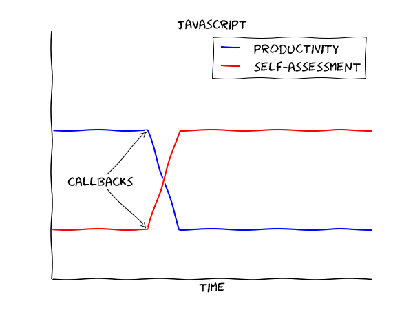
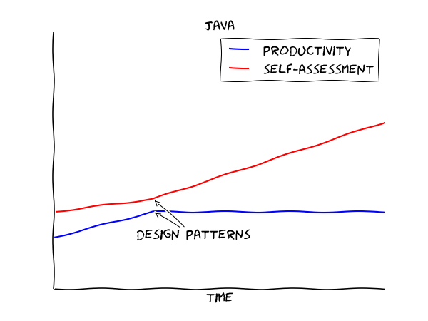
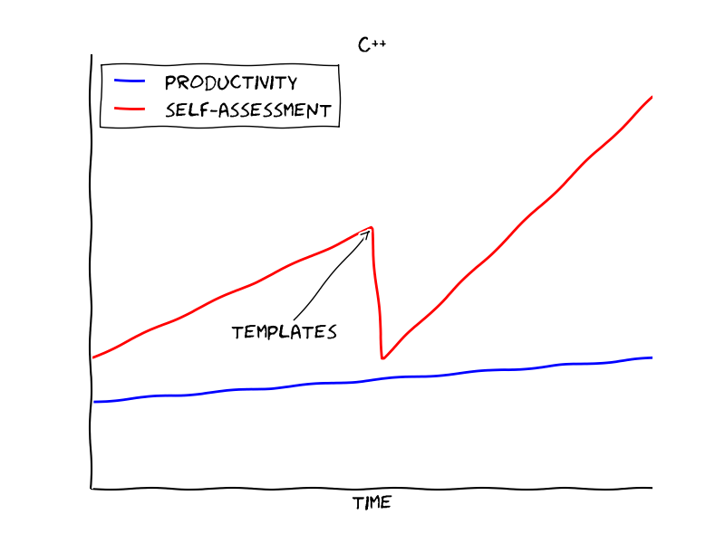
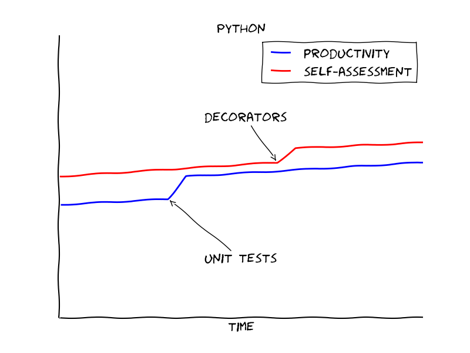
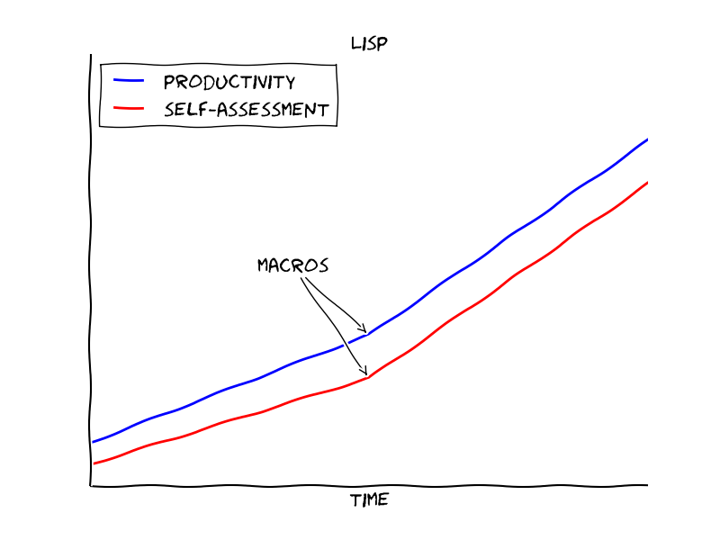
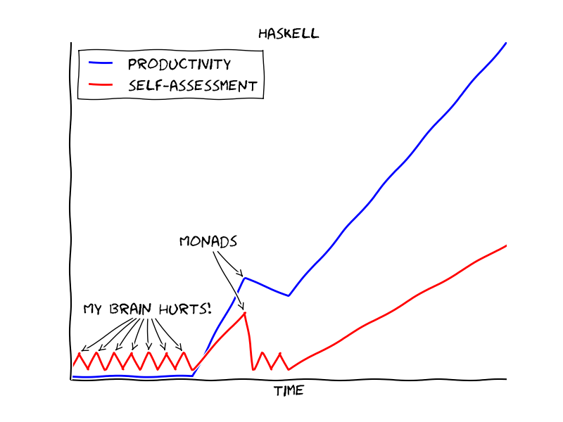
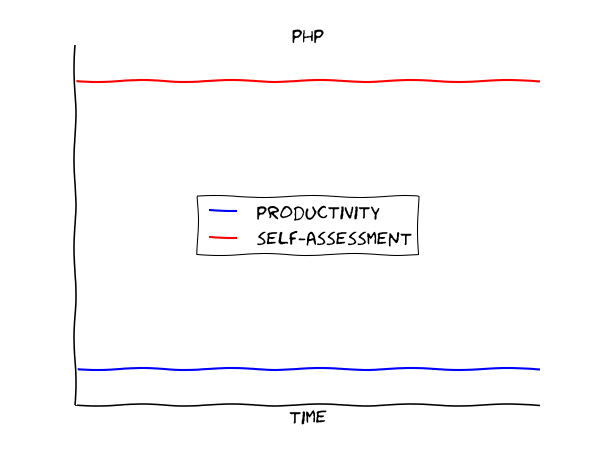

# Learning Curves (for different programming languages)

Disclaimer: The only purpose of this is to entertain. It has no empirical base whatsoever. ;-)

[Discuss on reddit](http://www.reddit.com/r/ProgrammerHumor/comments/2qeami/learning_curves_of_programming_languages/)