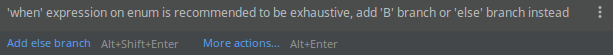

# When does a when expression in Kotlin need to be exhaustive, and when does it not

Recently, while working with Kotlin (version `1.3.50`), a colleague and I recognized
that we were unable to predict, in what cases,
and in what way (error or just a recommendation),
the IDE (IntelliJ IDEA version `2019.2.1`) does complain about non-exhaustive when expressions.

So I ran a short experiment, of which I'll present the results here.

The general test pattern looks as follows:

```kotlin
fun singleExperiment(x: EnumOrClass) {
    when (x) {
        Foo.A -> {
            someFunction()
        }
    }
}
```

So, the first thing to compare is `x` being
an instance of a derived class (passed as base-class reference)
or an enum:

```kotlin
enum class Foo { A, B }

open class Base
class Derived1 : Base()
class Derived2 : Base()
```

Also `someFunction` can return a value `Unit` or some actual type:

```kotlin
fun printSomething() = println(42)

fun returnSomething(): Int = 42
```

The third thing explore is
whether it makes a difference to assign the expression to a variable:

```kotlin
    val y = when (x) {
        ...
    }
}
```kotlin

This may sound absurd, but please bear with me. It will become relevant soon.

Last, we will check if using `let` in the following way changes things:

```kotlin
    x.let {
        when (it) {
            ...
        }
    }
```

So, we have 4 binary dimensions in our experiment space.

- `E`/`C` = enum or class (type of `x`)
- `N`/`L` = normal or let (way `x` is used)
- `S`/`A` = statement or assignment (usage of `when` expression)
- `U`/`V` = unit or value (`someFunction`'s return type)

The result of each possible combination can be:

- `O` = OK
- `R` = Recommendation only
- `F` = Failure (compilation error)

Let's explore all 16 corners of this hypercube one by one.


The given recommendation looks as follows:




The error message looks as follows:


That was interesting and somewhat surprising (at least to me).

I hope you also enjoyed this kind of weird exploration a bit.

If you'd like to discuss it,
or have a reasonable explanation for why this behavior can be observed,
I'd be happy to see your comments on [reddit](https://www.reddit.com/r/Kotlin/comments/cura4x/when_does_a_when_expression_in_kotlin_need_to_be/).

To finalize, here is a summary table to of the results:

| e/c   | n/l    | s/a        | u/v   | o/r/f          |
|-------|--------|------------|-------|----------------|
| enum  | normal | statement  | unit  | recommendation |
| class | normal | statement  | unit  | ok             |
| enum  | normal | statement  | value | recommendation |
| class | normal | statement  | value | ok             |
| enum  | let    | statement  | unit  | recommendation |
| class | let    | statement  | unit  | ok             |
| enum  | let    | statement  | value | failure        |
| class | let    | statement  | value | failure        |
| enum  | normal | assignment | unit  | failure        |
| class | normal | assignment | unit  | failure        |
| enum  | normal | assignment | value | failure        |
| class | normal | assignment | value | failure        |
| enum  | let    | assignment | unit  | recommendation |
| class | let    | assignment | unit  | ok             |
| enum  | let    | assignment | value | failure        |
| class | let    | assignment | value | failure        |

You can find the full source code to play around with [here](https://gist.github.com/Dobiasd/a7292aaf8f818e3303a2cfc55c69c6ab).
